# 実行計画 — Unazu-kiro（全自動うなずきマシーン）

## 詳細分析サマリー

### 変更影響評価

| 影響領域 | 有無 | 説明 |
|---------|------|------|
| ユーザー向け変更 | あり | 物理デバイス動作・音声出力・Web設定UIがユーザー体験に直結 |
| 構造的変更 | あり | 3層構成（クラウドAI / PCアプリ / ハードウェア）の新規設計 |
| データモデル変更 | あり | キーワード設定YAML・状態管理の設計が必要 |
| API変更 | あり | PC↔デバイス間WebSocket API・AWS各サービスとの連携 |
| NFR影響 | あり | レイテンシ3秒以内・デモ30分連続動作・ネットワーク断時フォールバック |

### リスク評価

| 項目 | 評価 |
|------|------|
| **リスクレベル** | 中（Medium） |
| **ロールバック複雑度** | 低（ハードウェアは独立動作可能） |
| **テスト複雑度** | 中（ソフト単体テストは容易、ハード統合テストは実機必要） |
| **主なリスク** | AWS Transcribe Streaming のレイテンシ、ハードウェア調達・組み立て、デモ当日のネットワーク環境 |

---

## ワークフロー可視化

```mermaid
flowchart TD
    Start(["ユーザーリクエスト"])

    subgraph INCEPTION["🔵 インセプションフェーズ"]
        WD["ワークスペース検出<br/><b>完了</b>"]
        RE["リバースエンジニアリング<br/><b>スキップ（新規）</b>"]
        RA["要件分析<br/><b>完了</b>"]
        US["ユーザーストーリー<br/><b>スキップ</b>"]
        WP["ワークフロー計画<br/><b>実行中</b>"]
        AD["アプリケーション設計<br/><b>実行</b>"]
        UG["ユニット生成<br/><b>実行</b>"]
    end

    subgraph CONSTRUCTION["🟢 コンストラクションフェーズ"]
        FD["機能設計<br/><b>実行</b>"]
        NFRA["NFR要件<br/><b>実行</b>"]
        NFRD["NFR設計<br/><b>実行</b>"]
        ID["インフラ設計<br/><b>実行</b>"]
        CG["コード生成<br/>（計画 + 生成）<br/><b>実行</b>"]
        BT["ビルド & テスト<br/><b>実行</b>"]
    end

    subgraph OPERATIONS["🟡 オペレーションフェーズ"]
        OPS["オペレーション<br/><b>プレースホルダー</b>"]
    end

    Start --> WD
    WD -.-> RE
    WD --> RA
    RE -.-> RA
    RA -.-> US
    RA --> WP
    US -.-> WP
    WP --> AD
    AD --> UG
    UG --> FD
    FD --> NFRA
    NFRA --> NFRD
    NFRD --> ID
    ID --> CG
    CG --> BT
    BT -.-> OPS
    BT --> End(["完了"])

    style WD fill:#4CAF50,stroke:#1B5E20,stroke-width:3px,color:#fff
    style RA fill:#4CAF50,stroke:#1B5E20,stroke-width:3px,color:#fff
    style WP fill:#4CAF50,stroke:#1B5E20,stroke-width:3px,color:#fff
    style CG fill:#4CAF50,stroke:#1B5E20,stroke-width:3px,color:#fff
    style BT fill:#4CAF50,stroke:#1B5E20,stroke-width:3px,color:#fff
    style RE fill:#BDBDBD,stroke:#424242,stroke-width:2px,stroke-dasharray: 5 5,color:#000
    style US fill:#BDBDBD,stroke:#424242,stroke-width:2px,stroke-dasharray: 5 5,color:#000
    style AD fill:#FFA726,stroke:#E65100,stroke-width:3px,stroke-dasharray: 5 5,color:#000
    style UG fill:#FFA726,stroke:#E65100,stroke-width:3px,stroke-dasharray: 5 5,color:#000
    style FD fill:#FFA726,stroke:#E65100,stroke-width:3px,stroke-dasharray: 5 5,color:#000
    style NFRA fill:#FFA726,stroke:#E65100,stroke-width:3px,stroke-dasharray: 5 5,color:#000
    style NFRD fill:#FFA726,stroke:#E65100,stroke-width:3px,stroke-dasharray: 5 5,color:#000
    style ID fill:#FFA726,stroke:#E65100,stroke-width:3px,stroke-dasharray: 5 5,color:#000
    style OPS fill:#BDBDBD,stroke:#424242,stroke-width:2px,stroke-dasharray: 5 5,color:#000
    style INCEPTION fill:#BBDEFB,stroke:#1565C0,stroke-width:3px,color:#000
    style CONSTRUCTION fill:#C8E6C9,stroke:#2E7D32,stroke-width:3px,color:#000
    style OPERATIONS fill:#FFF59D,stroke:#F57F17,stroke-width:3px,color:#000
    style Start fill:#CE93D8,stroke:#6A1B9A,stroke-width:3px,color:#000
    style End fill:#CE93D8,stroke:#6A1B9A,stroke-width:3px,color:#000

    linkStyle default stroke:#333,stroke-width:2px
```



### テキスト代替表現

```
インセプションフェーズ:
  [完了] ワークスペース検出
  [スキップ] リバースエンジニアリング（新規プロジェクトのため）
  [完了] 要件分析
  [スキップ] ユーザーストーリー（内部ツール・ハッカソン用途のため）
  [完了] ワークフロー計画
  [実行] アプリケーション設計
  [実行] ユニット生成

コンストラクションフェーズ（ユニットごと）:
  [実行] 機能設計
  [実行] NFR要件
  [実行] NFR設計
  [実行] インフラ設計
  [実行] コード生成（計画 + 生成）
  [実行] ビルド & テスト

オペレーションフェーズ:
  [プレースホルダー] オペレーション
```

---

## 実行フェーズ詳細

### 🔵 インセプションフェーズ

- [x] ワークスペース検出（完了）
- [x] リバースエンジニアリング（スキップ — グリーンフィールド）
- [x] 要件分析（完了）
- [x] ユーザーストーリー（スキップ — 理由後述）
- [x] ワークフロー計画（実行中）
- [ ] **アプリケーション設計 — 実行**
  - **理由**: 3つの新規コンポーネント（PCアプリ・Raspberry Piデバイス・設定Web UI）を新規設計する必要があり、コンポーネント間のインターフェース定義が必須
- [ ] **ユニット生成 — 実行**
  - **理由**: 3コンポーネントが独立して開発・テスト可能なため、ユニット分割により並行開発と段階的実装が可能

#### スキップ理由：ユーザーストーリー
ハッカソン向けの内部ツール・デモ用途であり、複数ユーザーペルソナや受け入れ基準の形式化が不要。要件定義書で十分にユースケースが網羅されている。

---

### 🟢 コンストラクションフェーズ

- [ ] **機能設計 — 実行**
  - **理由**: 音声認識→キーワード検知→サーボ制御のビジネスロジックフロー、状態管理（忖度ブースト中・生存確認タイマー等）の詳細設計が必要
- [ ] **NFR要件 — 実行**
  - **理由**: レイテンシ3秒以内・30分連続動作・ネットワーク断フォールバックなど明確なNFRが存在する
- [ ] **NFR設計 — 実行**
  - **理由**: NFR要件を実装パターンに落とし込む設計が必要（ストリーミング処理・再接続ロジック等）
- [ ] **インフラ設計 — 実行**
  - **理由**: AWS Transcribe Streaming / Lambda / Polly の具体的な構成、IAMロール、WebSocket通信の設計が必要
- [ ] **コード生成 — 実行（常時）**
  - **理由**: 全コンポーネントの実装
- [ ] **ビルド & テスト — 実行（常時）**
  - **理由**: ビルド・テスト・デモ手順の文書化

---

### 🟡 オペレーションフェーズ

- [ ] オペレーション — プレースホルダー（将来拡張）

---

## ユニット構成（予定）

| ユニット | 内容 | 依存関係 |
|---------|------|---------|
| **Unit 1: PCアプリ（音声キャプチャ & AIブリッジ）** | システム音声キャプチャ → AWS Transcribe → Lambda → Raspberry Pi へコマンド送信 | なし（先行開発可能） |
| **Unit 2: Raspberry Pi デバイス（ハードウェア制御）** | WebSocket受信 → サーボ制御 / AWS Polly 音声再生 / LED制御 | Unit 1のWebSocket APIに依存 |
| **Unit 3: 設定Web UI** | FastAPI + HTML/JS → keywords.yaml 読み書き → PCアプリへ即時反映 | Unit 1の設定管理モジュールに依存 |

---

## 推定タイムライン

| フェーズ | 推定時間 |
|---------|---------|
| アプリケーション設計 | 0.5日 |
| ユニット生成 | 0.5日 |
| Unit 1 設計 + コード生成 | 1.5日 |
| Unit 2 設計 + コード生成 | 1.5日 |
| Unit 3 設計 + コード生成 | 0.5日 |
| ビルド & テスト | 0.5日 |
| **合計** | **約5日（1週間以内）** |

---

## 成功基準

- **主目標**: ハッカソンのライブデモで全機能が動作すること
- **主要成果物**: PCアプリ・Raspberry Piデバイスコード・設定Web UI・セットアップ手順書
- **品質ゲート**:
  - 音声→うなずきのレイテンシ3秒以内
  - 30分連続動作
  - `python main.py` 1コマンドで起動
  - 審査員の前でキーワード変更→即時反映のデモが可能
